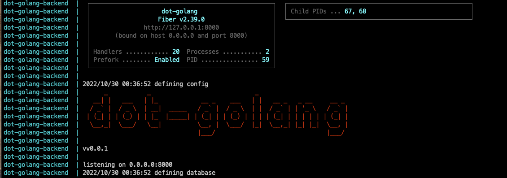

<!-- PROJECT LOGO -->
<br />
<p align="center">
  <h2 align="center">DOT - Backend</h2> <br />
</p>


<!-- TABLE OF CONTENTS -->
<details open="open">
  <summary>Table of Contents</summary>
  <ol>
    <li>
      <a href="#about-the-project">About The Project</a>
      <ul>
        <li><a href="#built-with">Built With</a></li>
      </ul>
    </li>
    <li>
      <a href="#getting-started">Getting Started</a>
      <ul>
        <li><a href="#prerequisites">Prerequisites</a></li>
        <li><a href="#installation">Installation</a></li>
      </ul>
    </li>
    <li><a href="#project-structure">Project structure</a></li>
  </ol>
</details>


<!-- ABOUT THE PROJECT -->
## About The Project

This system is using for DOT - Golang Developer.


<!-- BUILD WITH -->
#### Built With

* [Golang](https://golang.org)
* [PostgreSQL](https://www.postgresql.org/)
* [Fiber](https://docs.gofiber.io/)
* [Viper](https://github.com/spf13/viper)
* [Air](https://github.com/cosmtrek/air)
* [Traefik](https://traefik.io/)


<!-- GETTING STARTED -->
## Getting Started

This is an example of how you may give instructions on setting up your project locally.
To get a local copy up and running follow these simple example steps.


<!-- PREREQUISITES -->
#### Prerequisites

* I use macOS Catalina 10.15.7
  ```sh
  ❯ uname -a
  Darwin 192.168.1.25 19.6.0 Darwin Kernel Version 19.6.0:
   ```
* And then you need to install [Golang](https://golang.org/doc/install)

* After that check the installation and Golang version it must be above than 1.11 because we need the [Golang Modules](https://blog.golang.org/using-go-modules)
  ```sh
  > go version
  go version go1.19.2 darwin/amd64
   ```


<!-- INSTALLATION -->
## Installation

#### PostgreSQL Database Installation
1. Clone the repo
   ```sh
   git clone https://github.com/jadahbakar/dot-golang-pg-144.git
   ```
2. Install Pg with Docker
   ```sh
   make up
   ```
3. Config pgpass
   ```sh
   echo "localhost:5144:dot-golang:dot-golang:dot-golang*144" >> ~/.pgpass
   ```
3. Restore db
   ```sh
   make restore
   ```


#### Manual Installation For Application
1. Clone the repo
   ```sh
   git clone https://github.com/jadahbakar/dot-golang.git
   ```
2. Install Modules packages
   ```sh
   go mod tidy
   ```
   or
   ```sh
   go mod download
   ```
   
3. Run it (it will create docker images and container with autoreload)
   ```sh
   go run main.go
   ```   

#### Docker
1. Add dot-golang.com on /etc/hosts
   ```sh
   sudo echo "127.0.0.1 dot-golang.com" >> /etc/hosts
   ```
2. Clone the repo
   ```sh
   git clone https://github.com/jadahbakar/dot-golang.git
   ```
3. Run it (it will create docker images and container with autoreload)
   ```sh
   make devel-up
   ```
4. It will show on console:

    

5. Testing it on postman:

    Post :

    

    Get:

    

    Stats:

      

6. Stop 
   ```sh
   make devel-down
   ```
    or
   ```sh
   CTRL + C
   ```


<!-- Project structure -->
## Project Structure

```sh
.
├── README.md
├── config.env
├── docker
│   └── development
├── go.mod
├── go.sum
├── log
│   ├── fiber.log
│   └── dot-golang
├── main.go
├── makefile
├── mocks
│   └── Repository.go
├── repository
│   └── postgres
├── siswa
│   ├── handler.go
│   ├── model.go
│   ├── repository.go
│   ├── service.go
│   └── siswa.go
└── util
    ├── config
    ├── engine
    ├── generate
    ├── greet
    ├── logger
    └── response
```

